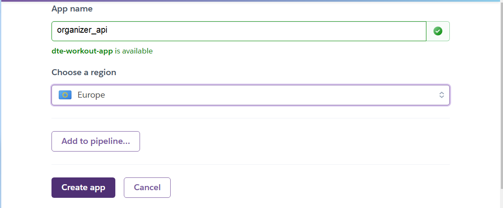

# ORGANIZER API

The API allows a front end application to store and access data for a basic organizer with a chat function.

- [ORGANIZER API](#organizer-api)
- [FRONTEND REPOSITORY](#frontend-repository)
- [FEATURES](#features)
- [Authentication](#authentication)
  - [Forming Teams](#forming-teams)
  - [Task Management](#task-management)
  - [Team Chat](#team-chat)
  - [Private Chat](#private-chat)
  - [PEP8 and Pylint](#pep8-and-pylint)
  - [ISSUES](#issues)
- [MODEL](#model)
  - [Setting up a database for the project](#setting-up-a-database-for-the-project)
  - [Adding database to settings.py](#adding-database-to-settingspy)
- [URL ROUTES FOR REQUESTS](#url-routes-for-requests)
  - [Authentication](#authentication-1)
    - [REGISTRATION](#registration)
      - [Response if SUCCESSFUL](#response-if-successful)
      - [ERROR User already exists](#error-user-already-exists)
      - [ERROR Password validation errors](#error-password-validation-errors)
    - [LOGIN](#login)
      - [Response if SUCCESSFUL](#response-if-successful-1)
      - [Response if no password was provided](#response-if-no-password-was-provided)
      - [Response if the username and password do not exist](#response-if-the-username-and-password-do-not-exist)
    - [LOGOUT](#logout)
    - [USER AND ACCESS TOKENS](#user-and-access-tokens)
      - [Response if SUCCESSFUL](#response-if-successful-2)
      - [Response if NOT LOGGED IN](#response-if-not-logged-in)
    - [REFRESH ACCESS TOKENS](#refresh-access-tokens)
      - [Response if NOT LOGGED IN](#response-if-not-logged-in-1)
      - [Response if SUCCESSFUL](#response-if-successful-3)
  - [Team app](#team-app)
  - [**The following URLs will only work for authenticated users!**](#the-following-urls-will-only-work-for-authenticated-users)
    - [LIST OF TEAMS](#list-of-teams)
      - [PARAMETERS](#parameters)
      - [Response](#response)
    - [LIST OF TEAM-MEMBERS](#list-of-team-members)
      - [Response if SUCCESSFUL](#response-if-successful-4)
      - [Response if no PERMISSION](#response-if-no-permission)
    - [TEAM MEMBER'S COUNT](#team-members-count)
      - [Response if SUCCESSFUL](#response-if-successful-5)
    - [CREATE NEW TEAM](#create-new-team)
      - [Response if SUCCESSFUL](#response-if-successful-6)
      - [Response if NAME FIELD IS EMPTY](#response-if-name-field-is-empty)
    - [RETRIEVE TEAM](#retrieve-team)
      - [Response if SUCCESSFUL](#response-if-successful-7)
        - [Response if NOT FOUND](#response-if-not-found)
    - [UPDATE TEAM](#update-team)
      - [Response if SUCCESSFUL](#response-if-successful-8)
      - [Response if NAME FIELD IS EMPTY](#response-if-name-field-is-empty-1)
    - [DELETE TEAM](#delete-team)
      - [Response if SUCCESSFUL](#response-if-successful-9)
        - [Response if NOT FOOUND](#response-if-not-foound)
    - [LIST OF TEAMMATES](#list-of-teammates)
      - [Response if SUCCESSFUL](#response-if-successful-10)
    - [LIST OF TEAM MEMBERSHIPS](#list-of-team-memberships)
      - [Response if SUCCESSFUL](#response-if-successful-11)
    - [CREATE MEMBERSHIP](#create-membership)
      - [Response if SUCCESSFUL](#response-if-successful-12)
    - [QUIT MEMBERSHIP](#quit-membership)
      - [Response if SUCCESSFUL](#response-if-successful-13)
      - [Response if NOT ALLOWED or NOT FOUND](#response-if-not-allowed-or-not-found)
  - [Team Chat](#team-chat-1)
    - [LIST OF MESSAGES](#list-of-messages)
      - [PARAMETERS](#parameters-1)
      - [Response if SUCCESSFUL](#response-if-successful-14)
    - [MESSAGE COUNT](#message-count)
      - [Response if SUCCESSFUL](#response-if-successful-15)
    - [POST A MESSAGE](#post-a-message)
      - [Response if SUCCESSFUL](#response-if-successful-16)
    - [UPDATE A MESSAGE](#update-a-message)
      - [Response if SUCCESSFUL](#response-if-successful-17)
  - [Response if the team field or message field is missing](#response-if-the-team-field-or-message-field-is-missing)
    - [DELETE A MESSAGE](#delete-a-message)
      - [Response if SUCCESSFUL](#response-if-successful-18)
      - [Response if no PERMISSION](#response-if-no-permission-1)
      - [Response if message NOT FOUND](#response-if-message-not-found)
  - [Private Chat](#private-chat-1)
    - [LIST OF MESSAGES](#list-of-messages-1)
      - [PARAMETERS](#parameters-2)
      - [Response if SUCCESSFUL](#response-if-successful-19)
    - [MESSAGE COUNT (Private Chat)](#message-count-private-chat)
      - [Response if SUCCESSFUL](#response-if-successful-20)
    - [POST A MESSAGE (Private Chat)](#post-a-message-private-chat)
      - [Response if SUCCESSFUL](#response-if-successful-21)
    - [UPDATE A MESSAGE (Private Chat)](#update-a-message-private-chat)
      - [Response if SUCCESSFUL](#response-if-successful-22)
    - [DELETE A MESSAGE (Private Chat)](#delete-a-message-private-chat)
      - [Response if SUCCESSFUL](#response-if-successful-23)
      - [Response if no PERMISSION](#response-if-no-permission-2)
      - [Response if message NOT FOUND](#response-if-message-not-found-1)
    - [LIST OF TASKS](#list-of-tasks)
      - [PARAMETERS](#parameters-3)
      - [Response if SUCCESSFUL](#response-if-successful-24)
    - [CREATE TASK](#create-task)
  - [**NOTE! Use form-data if you want to upload an image file in the request**](#note-use-form-data-if-you-want-to-upload-an-image-file-in-the-request)
      - [Response if SUCCESSFUL](#response-if-successful-25)
      - [Response if VALIDATION ERRORS](#response-if-validation-errors)
    - [RETRIEVE TASK BY ID](#retrieve-task-by-id)
      - [Response if SUCCESSFUL](#response-if-successful-26)
      - [UPDATE TASK BY ID](#update-task-by-id)
  - [Test summary](#test-summary)
    - [DELETE TASK BY ID](#delete-task-by-id)
  - [Test summary](#test-summary-1)
      - [Response if DELETED](#response-if-deleted)
  - [Status-Code: 204 No Content](#status-code-204-no-content)
      - [Response if NOT FOUND](#response-if-not-found-1)
  - [Status Code: 404 Not found](#status-code-404-not-found)
- [TEST SUMMARIES](#test-summaries)
  - [Authentication](#authentication-2)
  - [provided by Code Institute and can be found in organizer\_api\_prj.views.py](#provided-by-code-institute-and-can-be-found-in-organizer_api_prjviewspy)
    - [Registration](#registration-1)
  - [Test Details](#test-details)
    - [Login](#login-1)
  - [Test Details](#test-details-1)
  - [Test Listing Tasks](#test-listing-tasks)
  - [Test Creating Tasks](#test-creating-tasks)
  - [Test Deleting Tasks](#test-deleting-tasks)
  - [Test Updating Tasks](#test-updating-tasks)
  - [Test Listing Teams](#test-listing-teams)
  - [Test creating Teams](#test-creating-teams)
  - [Test updating Teams](#test-updating-teams)
  - [Test joining Teams](#test-joining-teams)
  - [Test leaving Teams](#test-leaving-teams)
  - [Test Listing Team Chat messages](#test-listing-team-chat-messages)
  - [Test Posting Team Chat Messages](#test-posting-team-chat-messages)
  - [Test Updating Team Chat Messages](#test-updating-team-chat-messages)
- [Deployment](#deployment)
  - [Cloudinary account](#cloudinary-account)
  - [Database settings](#database-settings)
  - [Client origin](#client-origin)
  - [Secret key](#secret-key)
  - [Debugging](#debugging)
    - [To turn the debugging mode back off](#to-turn-the-debugging-mode-back-off)
    - [ALLOWED\_HOSTS](#allowed_hosts)
    - [Deployment on heroku](#deployment-on-heroku)
  - [Go to heroku](#go-to-heroku)

# FRONTEND REPOSITORY
[Open Frontend Repository](https://github.com/dimitri-edel/organizer-react)

---
# FEATURES
---
# Authentication
Users can register with the API. Upon registration they can sign in or out, using their credentials.
[See URL Requests for Authentication](#authentication)

---

## Forming Teams
Authenticated users can create Teams. A Team entity contains the id of the user whoe created it and the name of the team. The user who created the team can also rename it or delete it. [See URL Requests for Forming Teams](#forming-teams)
Authenticated users can [view a list of teams](#list-of-teams), [join teams](#create-memebership), [leave teams](#quit-membership).

---

## Task Management
Authenticated users can [list](#list-of-tasks), [create](#create-task), [edit](#update-task-by-id), 
[retrieve](#retrieve-task-by-id) and [delete](#delete-task-by-id) Tasks.

Also, the users can assign tasks to their teammates. In order to assign a task to a teammate, you will need to specify
their user-ID in your request, when creating or editing a task. Follow [this link](#list-of-teammates) to see how to
retrieve a list of teammates with their IDs.

---

## Team Chat
Users who are members of a Team can exchange messages in a Team Chat. The API provides the following possibilities :
- [list messages](#list-of-messages) 
- [post messages](#post-a-message) 
- [edit messages](#update-a-message)
- [delete message](#delete-a-message)
- [get a total number of messages](#message-count)

---

## Private Chat
Users who are members of a Team can exchange private messages in a Private Chat Room. The API provides the following possibilities:
- [list messages](#list-of-messages-1)
- [post messages](#post-a-message-private-chat)
- [edit messages](#update-a-message-private-chat)
- [delete messages](#delete-a-message-private-chat)
- [get a total number of messages](#message-count-private-chat)

## PEP8 and Pylint
For linting the code I used pylint to validate the code. Thus, it is mandatory that Pylint be used to validate the code on another machine, because it was necessary to apply a few instructions for that tool in the code. For instance, it does not recognize dynamically attached properties and will throw an error, even if the property is valid.

## ISSUES
A copy of **env.py** with **credentials** was pushed to the repository in the beginning, because I forgot to add it to gitignore. The file itself is gone, but a binary file with the extension **pyc** is still there. I have tried to remove it with **filter-branch** but it wouldn't work. So I contacted a tutor and he told me to change the credentials and mention it in the readme file. As a result, I have changed the credentials and the ones in the file are not valid.

---

# MODEL
Here is a sketch of how the model types are related to each other.

---

## Setting up a database for the project
For this Project I have decided to use an external database on one of the servers that I rent. It is a PostgreSQL Server with pgAdmin as a Management Tool. In order to set up a new database I need to first log in to pgAdmin.

Then I need to create a database.

Next I need to name the database and assign a user as its owner. In other words, a user that can edit the database. I already have a user for this app, so I just need to select him from a dropdown menu. In this case the username is heroku-organizer-backend(not the actual name though) and they have all the privileges that are necessary for editing this database.

Now the database is ready to be used. At least for django it is, because django will automatically map the models to this database when the manage.py migrate script is executed. Alongside all the models that I will define in the scope of this project, django will also map models from other apps that I am going to use in this project, such as django-allauth, the users for django.contrib.auth and so on.

## Adding database to settings.py
First of all, since I am going to store the project on GitHub, I cannot publicly share the credentials used for the database. So I will store them in a file that will be added to gitignore. In settings.py I will only use variables that correspond to the credentials.

I need to import the environment variables that I defined in env.py. Since, I am using a wildcard-import from .env import * I need to let the linter know that it is fine. I am doing that because there are no classes defined in that file only a number of os.eniron assignments. Which you can see as a setting for pylint in form of a comment: # pylint: disable=wildcard-import Also,I need to override the standard SQLite engine setting in settings.py by providing my set of settings:

<code>

\#pylint: disable=wildcard-import
from pathlib import Path
import os
if os.path.exists('organizer_api_prj/env.py'):
from .env import *

</code>

<code>
DATABASES = {

    "default": {

        'ENGINE': 'django.db.backends.postgresql_psycopg2',

        'NAME': os.environ['DB_NAME'],

        'USER': os.environ['DB_USER'],

        'PASSWORD': os.environ['DB_PASSWORD'],

        'HOST': os.environ['DB_HOST'],

        'PORT': os.environ['DB_PORT'],
    }
}

</code>

Now, when the models are already in place, one must run **manage.py makemigrations** and then **manage.py migrate**

The environment variables for the database above are the ones that will later translate to the **ConfigVars** on **heroku**.

# URL ROUTES FOR REQUESTS

All of the following URLs must be appended to the **ROOT URL** of the API.
**ROOT URL** [deployedURL]

## Authentication

### REGISTRATION

[Test summary](#registration-1)

Request Method: **POST**

Content-Type: **application/json** or **multipart/form-data***

URL: **/dj-rest-auth/registration/**

Body:
<code>
{
    "username" : "desired username",
    "password1" : "password",
    "password2" : "password"
}
</code>

Required fields:
- **username** the username under which the user will be registered
- **password1** password
- **password2** password

---

#### Response if SUCCESSFUL
Status Code: 201 Created

Content-Type: **application/json**

Body: 
<code>
"access_token":"token_value", "refresh_token":"token_value", 
"user":{ 
    "pk", "integer", "username":"some name", "email", "some email", "first_name", "john", "last_name": "doe"
}
</code>

---

#### ERROR User already exists
Status Code: 400 Bad Request

Content-Type: **application/json**

Body: 
<code>
{
    "username": [
        "A user with that username already exists."
    ]
}
</code>

---
#### ERROR Password validation errors
Status Code: 400 Bad Request

Content-Type: **application/json**

Body: 
<code>
{
    "password1": [
        "This password is too short. It must contain at least 8 characters.",
        "This password is too common.",
        "This password is entirely numeric."
    ]
}
</code>

If password1 and password2 don't match the Body will look like this:
<code>
{
    "non_field_errors": [
        "The two password fields didn't match."
    ]
}
</code>

---

### LOGIN

[Test summary](#login-1)

Request Method: **POST**

Content-Type: **application/json** or **multipart/form-data***

URL **/dj-rest-auth/login/**

Body: 
<code>
{
    "username": "someusername",
    "password": "somepassword"
}
</code>

---
#### Response if SUCCESSFUL
Status Code: 200 OK

Content-Type: **application/json**

Body: 
<code>
"access_token":"token_value", "refresh_token":"token_value", 
"user":{ 
    "pk", "integer", "username":"some name", "email", "some email", "first_name", "john", "last_name": "doe"
}

</code>

---
#### Response if no password was provided
Status Code: 400 Bad Request

Content-Type: **application/json**

Body: 
<code>
{
    "password": [
        "This field may not be blank."
    ]
}
</code>

---
#### Response if the username and password do not exist
Status Code: 400 Bad Request

Content-Type: **application/json**

Body: 
<code>
{
    "non_field_errors": [
        "Unable to log in with provided credentials."
    ]
}
</code>

---
### LOGOUT
Request Method: **POST**

URL : **/dj-rest-auth/logout/**

**No Payload required**

---

### USER AND ACCESS TOKENS
**Request user data for for an authenticated user**

Request Method: **GET**

URL:  **/dj-rest-auth/user/**

**No Payload required**

---
#### Response if SUCCESSFUL
Status Code: 200 OK

Content-Type: **application/json**

Body: 
<code>
{
    "pk": 11,
    "username": "tester4",
    "email": "",
    "first_name": "",
    "last_name": ""
}
</code>

**Access tokens** will also be attached to the response in **cookies**.

---
#### Response if NOT LOGGED IN
Status Code: 401 Unauthorized

Content-Type: **application/json**

Body: 
<code>
{
    "detail": "Authentication credentials were not provided."
}
</code>

---
### REFRESH ACCESS TOKENS
Request Method: **POST**

URL: **/dj-rest-auth/token/refresh/**

**No Payload required, except for the cookies in the request**

---
#### Response if NOT LOGGED IN
Status Code: 401 Unauthorized

Content-Type: **application/json**

Body: 
<code>
{
    "detail": "No valid refresh token found.",
    "code": "token_not_valid"
}
</code>

---
#### Response if SUCCESSFUL
Status Code: 200 OK

Content-Type: **application/json**

Body: 
<code>
{
    "access": "a-long-string-of-jibber-jabber",
    "access_token_expiration": "2023-08-26T11:05:05.727454Z"
}
</code>

**Access tokens** will be attached to the **Cookies** in the Response as well.

---
## Team app

**The following URLs will only work for authenticated users!**
---
### LIST OF TEAMS

[Test summary](#test-listing-teams)

Request Method: **GET**

URL: **/team/**

#### PARAMETERS
- **search** filters the list by username and name of the team. For example: "/team/?search=dj" will give you a list of all teams whose name begin with dj or whose owners username begins with dj
- **ordering** orders the list by  name. For example "team/?search=dj&ordering=name will give you a list of teams whose owners username begins with dj or whose name begins with dj. The list will be ordered by username in ascending order. If you want the filter to order in descending order just add a **-** at the front like so: ordering=-name.
- **name** or **owner__username** will filter the results by either name of team or username of its owner
- **offset** and **limit** are used for pagination. By default the pagination is set to offset=0 and limit=3. Which means that each page will have three items. But if you want to up the number of items you can just set limit=[a number]. For instance, if I want to have 5 items per page and want to begin with the third entry: &offset=2&limit=5

---
#### Response
Status Code: 200 OK

Conent-Type: application/json

Body:
<code>
{
    "count": 8,
    "next": "http://127.0.0.1:8000/team/?limit=3&offset=3",
    "previous": null,
    "results": [
        {
            "id": 2,
            "owner": "dj_admin",
            "name": "Administration changed",
            "is_member": false
        },
        {
            "id": 6,
            "owner": "dj_test",
            "name": "Chill Team",
            "is_member": false
        }
        ...
    ]
}
</code>

The data is **paginated**. Thus,**count** is the number of entries, **next** is the index of the next page,
**previous** is the index of the previous page, **results** is the actual data in form of an array.
The array holds a set of dictionaries with the following attributes for each team
- **id** is the id of the team
- **owner** is the username of the one who owns the team
- **name** is the name of the team
- **is_member** is a boolean that signigies whether or not user requesting the information is member of that team

---
### LIST OF TEAM-MEMBERS
Request Method: **GET**

URL: **/team-members/<int:pk>**

#### Response if SUCCESSFUL
Status Code: 200 OK

Conent-Type: application/json

Body:
<code>
[
    {
        "user_id": 1,
        "username": "dj_admin"
    },
    {
        "user_id": 2,
        "username": "wo_admin"
    },
    {
        "user_id": 14,
        "username": "eval"
    }
]
</code>

---
#### Response if no PERMISSION 

This response will also come back if the requested team does not exist, because django's permission classes will come in first. If looking for the team fails an exception will be thrown and the permission will be denied

Status Code: 403 FORBIDDEN

Conent-Type: application/json

Body:
<code>
{
    "detail": "You do not have permission to perform this action."
}
</code>

---

### TEAM MEMBER'S COUNT
This request is useful for updating the view if new members join the team
equest Method: **GET**

URL: **/team-members-count/<int:pk>**

#### Response if SUCCESSFUL
Status Code: 200 OK

Conent-Type: application/json

Body:
<code>
{
    "count": 2
}
</code>

---
### CREATE NEW TEAM

[Test summary](#test-creating-teams)

Request Method **POST**

Content-Type: **application/json** or **multipart/form-data**

URL: **/team/**

Body: **{ "name":"name of team" }**

---
#### Response if SUCCESSFUL
Status Code: 200 OK

Conent-Type: application/json

Body:
<code>
{
    "count": 8,
    "next": "http://127.0.0.1:8000/team/?limit=3&offset=3",
    "previous": null,
    "results": [
        {
            "id": 2,
            "owner": "dj_admin",
            "name": "Administration changed",
            "is_member": false
        },
        {
            "id": 6,
            "owner": "dj_test",
            "name": "Chill Team",
            "is_member": false
        }
        ...
    ]
}
</code>

---
#### Response if NAME FIELD IS EMPTY
Status Code: 400 Bad Request

Conent-Type: application/json

Body:
<code>
{
    "name": [
        "This field may not be blank."
    ]
}
</code>

---
### RETRIEVE TEAM
Request Method: **GET**

URL: **/team/<int:pk>/**, where the private key(ID) of the team msut be specified in the path

---
#### Response if SUCCESSFUL
Status Code: 200 OK

Content-Type: application/json
Body:
<code>
{
    "id": 7,
    "owner": "dj_admin",
    "name": "New team",
    "is_member": false
}
</code>

Fields: 
- **id** is the private key of the team
- **owner** is the username of the one who created the team
- **name** is the name of the team,
- **is_member** is a boolean value that specified if the user in the request is a member of that team

---
##### Response if NOT FOUND
Status Code: 404 Not Found

Content-Type: application/json

Body:
<code>
{
    "detail": "Not found."
}
</code>

---
### UPDATE TEAM

[Test summary](#test-updating-teams)

Request Method: **PUT**

URL:  **/team/<int:pk>/** pk is the private key of the team, which is an integer value

Content-Type: **application/json** or **multipart/form-data**

Body:  **{ "name": "new value" }**

---
#### Response if SUCCESSFUL
Status Code: 200 OK

Content-Type: **application/json**

Body: 
<code>
{
    "id": 7,
    "owner": "your username",
    "name": "XXX Team",
    "is_member": false
}
</code>

Fields: 
- **id** is the private key of the team
- **owner** is the username of the one who created the team
- **name** is the name of the team,
- **is_member** is a boolean value that specified if the user in the request is a member of that team

---
#### Response if NAME FIELD IS EMPTY
Status Code: 400 Bad Request

Content-Type: **application/json**

Body: 
<code>
{
    "name": [
        "This field may not be blank."
    ]
}
</code>

---
### DELETE TEAM
Request Method: **DELETE**

URL:  **/team/<int:pk>/** pk is the private key of the team, which is an integer value

**No Payload required**

---
#### Response if SUCCESSFUL
Status Code: 204 No Conent

---
##### Response if NOT FOOUND
Status Code: 404 Not Found

Content-Type: application/json

Body:
<code>
{
    "detail": "Not found."
}
</code>

---
### LIST OF TEAMMATES
Request Method: **GET**

URL: **/teammates/** 

**No Payload required**

#### Response if SUCCESSFUL
Status Code : 200 OK

Contenxt-Type: application/json

Body:
<code>
{
    "count": 3,
    "next": null,
    "previous": null,
    "results": [
        {
            "id": 1,
            "team_name": "DJ Team",
            "team": 1,
            "user_id": 3,
            "member": "dj_test"
        },
        {
            "id": 6,
            "team_name": "DJ Team",
            "team": 1,
            "user_id": 4,
            "member": "tester1"
        }
    ]
}
</code>

The data is paginated. Thus, **count** is the number of entries, **next** is the index of the next page,
**previous** is the index of the previous page, **results** is the actual data in form of an array.
The array holds a set of dictionaries with the following attributes for each teammate:
- **id** is the id of the team
- **team_name** is the name of the team
- **user_id** is the id of the user that is a member of the team
- **member** is the username of the teammate

---
### LIST OF TEAM MEMBERSHIPS
**NOTE! The list will only contain teams that the are not owned by the user in the request!**

Request Method: **GET**

URL: **/membership/**

**No Payload required**

---
#### Response if SUCCESSFUL
Status Code: 200 OK

Content-Type: application/json

Body:
<code>
{
    "count": 2,
    "next": null,
    "previous": null,
    "results": [
        {
            "id": 14,
            "team_name": "Testing",
            "team": 4,
            "user_id": 1,
            "member": "dj_admin"
        },
        {
            "id": 13,
            "team_name": "Extensive testing",
            "team": 12,
            "user_id": 1,
            "member": "dj_admin"
        }
    ]
}
</code>

The data is paginated. Thus  **count** is the number of entries, **next** is the index of the next page,
**previous** is the index of the previous page, **results** is the actual data in form of an array.
The array holds a set of dictionaries with the following attributes for each membership:
- **id** is the membership id
- **team_name** is the name of the team that the membership is of
- **user_id** is the own user.id
- **member** is your username

---
### CREATE MEMBERSHIP

[Test summary](#test-joining-teams)

Response Method: **POST**

Content-Type: **application/json** or **multipart/form-data**

URL: **/membership/**

Body:
<code>
{
    "team": 12    
}    
</code>

Fields:
- **team** is the private key (ID) of the team that the user wants to join

---
#### Response if SUCCESSFUL
Status Code: 201 Created

Content-Type: application/json

Body:
<code>
{
    "id": 15,
    "team_name": "Extensive testing",
    "team": 12,
    "user_id": 1,
    "member": "dj_admin"
}
</code>

Fields:
- **id** is the membership id
- **team_name** is the name of the team that the membership is of
- **user_id** is the own user.id
- **member** is your username

---
### QUIT MEMBERSHIP

[Test summary](#test-leaving-teams)

Request Method: **DELETE**

URL: **/leave/team/<int:team_id>**

**No Payload required**

---
#### Response if SUCCESSFUL
Status Code: 204 No Content

---
#### Response if NOT ALLOWED or NOT FOUND
Status Code: 404 Not Found

Conent-Type: application/json

Body:
<code>
{
    "detail": "Not found."
}
</code>

---
## Team Chat

### LIST OF MESSAGES

[Test summary](#test-listing-team-chat-messages)

Request-Method : **GET**

UR: **/team-chat-list/**

#### PARAMETERS
- **search** allows you to search for items by title, username of owner or due_date. For example, /tasks/?search=2023-09 will give you all tasks that are due in September 2023. /tasks/?search=tester will give a list that contains tasks whose title begins with tester or whose owners username begins with tester. However, it will only list either your own tasks or tasks that have been assigned to you by other users.
- **team_id** the private key of the targeted team.
- **minus_days**  Filter the messages to only contain messages that are older than minus_days. In other words, if minus_days equals to 5 then the query will only return the messages posted in the last 5 days
- **limit** number of items per page (pagination)
- **offset** starting with item number (pagination)

#### Response if SUCCESSFUL
Status Code: 200 OK

Content-Type: application/json

Body:
<code>
{
    "count": 5,
    "next": "https://organizer-api-f1f640e8d82c.herokuapp.com/team-chat-list/?limit=3&offset=3&team_id=8",
    "previous": null,
    "results": [
        {
            "id": 39,
            "team": 8,
            "owner": "dj_admin",
            "message": "one message from the dev mode altered",
            "created_at": "15 Nov 2023 06:07",
            "image": null
        },
        {
            "id": 40,
            "team": 8,
            "owner": "dj_admin",
            "message": "another message from dev mode",
            "created_at": "15 Nov 2023 06:27",
            "image": null
        },
        {
            "id": 41,
            "team": 8,
            "owner": "dj_admin",
            "message": "test again",
            "created_at": "15 Nov 2023 06:49",
            "image": null
        }
    ]
}
</code>

The **data** field is paginated. Thus, **count** is the number of entries, **next** is the index of the next page,
**previous** is the index of the previous page, **results** is the actual data in form of an array.

The array holds a set of dictionaries with the following attributes for each Message:
**id**:  private key of the message
**team**: private key of the team
**owner**: username of the owner
**message**: the text of the message
**created_at**: "date and time of when the message was posted
**image**: URL of an image or null

If **no team** with the given **id** is found, the **count** will be **zero**

### MESSAGE COUNT
Request Method: **GET**

URL: **team-chat-message-count/<int:team_id>**

#### Response if SUCCESSFUL
Status Code: 200 OK

Content-Type: application/json

Body:
<code>
{
    "count": 5
}
</code>

**count** is the total number of messages in the given team chat

---
### POST A MESSAGE

[Test summary](#test-posting-team-chat-messages)

Request Method: **POST**

Content-Type: **application/json** or **multipart/form-data**

URL : **/team-chat-post/<int:team_id>**

Body:
<code>
{
    "team" : 8
    "message" : "some message from postman"
    "image" : null
}
</code>

**NOTE! Use form-data if you want to upload an image file in the request**

#### Response if SUCCESSFUL
Status Code: **201 CREATED**

Content-Type: **application/json**

Body:
<code>
{
    "id": 44,
    "team": 8,
    "owner": "wo_admin",
    "message": "some message from postman",
    "created_at": "15 Nov 2023 19:01",
    "image": null
}
</code>

---
### UPDATE A MESSAGE

[Test summary](#test-updating-team-chat-messages)

Request Method: **PUT**

Content-Type: **application/json** or **multipart/form-data**

URL : **/team-chat-put/<int:message_id>**

Body:
<code>
{
    "team" : 8
    "message" : "some updated message from postman"
    "image" : null
}
</code>

**NOTE! Use form-data if you want to upload an image file in the request**

#### Response if SUCCESSFUL
Status Code: **200 OK**

Content-Type: **application/json**

Body:
<code>
{
    "team" : 8
    "message" : "some updated message from postman"
    "image" : null
}
</code>

## Response if the team field or message field is missing
Status-Code: **400 Bad Request**

Content-type: **application/json**

Body:
<code>
{
    "message": [
        "This field is required."
    ]
}
</code>

### DELETE A MESSAGE
Request Method: **DELETE**

URL: **/team-chat-delete/<int:message_id>**

#### Response if SUCCESSFUL
Status Code: 200 OK

Content-Type: **application/json**

Body:
<code>
{
    "details": "message deleted!"
}
</code>

#### Response if no PERMISSION
Status Code: 403 Forbidden

Content-Type: **application/json**

Body:
<code>
{
    "detail": "You do not have permission to perform this action."
}
</code>

---
#### Response if message NOT FOUND 
Status Code: 404 NOT FOUND

---
## Private Chat

### LIST OF MESSAGES
Request-Method : **GET**

UR: **/private-chat-list/**

#### PARAMETERS
- **search** allows you to search for items by title, username of owner or due_date. For example, /tasks/?search=2023-09 will give you all tasks that are due in September 2023. /tasks/?search=tester will give a list that contains tasks whose title begins with tester or whose owners username begins with tester. However, it will only list either your own tasks or tasks that have been assigned to you by other users.
- **team_id** the private key of the targeted team.
- **from_user_id** the private key of the private chat member (who the messages were sent to or from)
- **minus_days**  Filter the messages to only contain messages that are older than minus_days. In other words, if minus_days equals to 5 then the query will only return the messages posted in the last 5 days
- **limit** number of items per page (pagination)
- **offset** starting with item number (pagination)

#### Response if SUCCESSFUL
Status Code: 200 OK

Content-Type: application/json

Body:
<code>
{
    "count": 2,
    "next": null,
    "previous": null,
    "results": [
        {
            "id": 16,
            "team": 8,
            "owner": "wo_admin",
            "recipient": "dj_admin",
            "message": "hello to dj admin from wo admin",
            "created_at": "15 Nov 2023 07:09",
            "image": null
        },
        {
            "id": 17,
            "team": 8,
            "owner": "dj_admin",
            "recipient": "wo_admin",
            "message": "hello from dj admin",
            "created_at": "15 Nov 2023 07:43",
            "image": null
        }
    ]
}
</code>

The **data** field is paginated. Thus, **count** is the number of entries, **next** is the index of the next page,
**previous** is the index of the previous page, **results** is the actual data in form of an array.

The array holds a set of dictionaries with the following attributes for each Message:
**id**:  private key of the message
**team**: private key of the team
**owner**: username of the owner
**recipient**: user with whom them messages were exchanged
**message**: the text of the message
**created_at**: "date and time of when the message was posted
**image**: URL of an image or null

If **no team** with the given **id** is found, the **count** will be **zero**

---
### MESSAGE COUNT (Private Chat)
Request Method: **GET**

URL: **private-chat-message-count/<int:team_id>/<int:recipient_id>**

**recipient_id** signifies the user with whom the messages were exchanged

#### Response if SUCCESSFUL
Status Code: 200 OK

Content-Type: application/json

Body:
<code>
{
    "count": 5
}
</code>

**count** is the total number of messages in the given team chat

---
### POST A MESSAGE (Private Chat)
Request Method: **POST**

Content-Type: **application/json** or **multipart/form-data**

URL : **/private-chat-post/<int:team_id>/<int:recipient_id>**

Body:
<code>
{
    "team" : 8
    "message" : "dj_admin from postman"
    "image" : null
}
</code>

**NOTE! Use form-data if you want to upload an image file in the request**

#### Response if SUCCESSFUL
Status Code: **201 CREATED**

Content-Type: **application/json**

Body:
<code>
{
    "id": 18,
    "team": 8,
    "owner": "wo_admin",
    "recipient": "wo_admin",
    "message": "dj_admin from postman",
    "created_at": "15 Nov 2023 20:54",
    "image": null
}
</code>

---
### UPDATE A MESSAGE (Private Chat)
Request Method: **PUT**

Content-Type: **application/json** or **multipart/form-data**

URL : **/private-chat-put/<int:message_id>**

Body:
<code>
{
    "team" : 8
    "message" : "some updated message from postman"
    "image" : null
}
</code>

**NOTE! Use form-data if you want to upload an image file in the request**

#### Response if SUCCESSFUL
Status Code: **200 OK**

Content-Type: **application/json**

Body:
<code>
{
    "team" : 8
    "message" : "some updated message from postman"
    "image" : null
}
</code>

### DELETE A MESSAGE (Private Chat)
Request Method: **DELETE**

URL: **/private-chat-delete/<int:message_id>**

#### Response if SUCCESSFUL
Status Code: 200 OK

Content-Type: **application/json**

Body:
<code>
{
    "details": "message deleted!"
}
</code>

#### Response if no PERMISSION
Status Code: 403 Forbidden

Content-Type: **application/json**

Body:
<code>
{
    "detail": "You do not have permission to perform this action."
}
</code>

---
#### Response if message NOT FOUND 
Status Code: 404 NOT FOUND

---
### LIST OF TASKS 
[Test summary](#test-listing-tasks)

Request Method: **GET**

URL:  **/tasks/**

**No Payload required**

#### PARAMETERS
- **search** allows you to search for items by title, username of owner or due_date. For example, /tasks/?search=2023-09 will give you all tasks that are due in September 2023. /tasks/?search=tester will give a list that contains tasks whose title begins with tester or whose owners username begins with tester. However, it will only list either your own tasks or tasks that have been assigned to you by other users.
- **ordering** allows you to order the results by due_date, priority or status. For example: /tasks/?ordering=priority will give you a list that is ordered by priority in ascending order. To order it in descending order add a **-** after **=**, like so &ordering=-priority.
- **owner, due_date, category, priority, status** any one of these parameters can be used to filter the results. For instance, /tasks/?owner=tester?category=0 will give you all Chores of the user tester, provided that the user has assigend any tasks to you.

**NOTE! due_date is a datetime object so it expects a specific time. It is useless when it comes to filtering out tasks that belong to a specific day. For that purpose it is better to use the search filter as shown in the example above.**

---
#### Response if SUCCESSFUL
Status Code: 200 OK

Content-Type: application/json

Body:
<code>
{
    "count": 35,
    "next": "https://organizer-api-f1f640e8d82c.herokuapp.com/tasks/?limit=3&offset=3",
    "previous": null,
    "results": [
        {
            "id": 20,
            "owner": "dj_admin",
            "is_owner": true,
            "asigned_to": null,
            "title": "ADASFAD",
            "comment": "rzuzr4uz6r4uru",
            "due_date": "15 Sep 2023 15:41",
            "category": 0,
            "priority": 2,
            "status": 0,
            "file": null
        },
        {
            "id": 31,
            "owner": "dj_admin",
            "is_owner": true,
            "asigned_to": null,
            "title": "third thing",
            "comment": "coment coment coment coment coment coment coment coment coment coment coment coment coment coment coment coment coment coment",
            "due_date": "01 Sep 2023 20:57",
            "category": 0,
            "priority": 0,
            "status": 0,
            "file": null
        },
        {
            "id": 25,
            "owner": "dj_admin",
            "is_owner": true,
            "asigned_to": null,
            "title": "some other task for septemper",
            "comment": "comenting ...comenting ...comenting ...comenting ...comenting ...comenting ...comenting ...comenting ...comenting ...comenting ...comenting ...comenting ...comenting ...comenting ...",
            "due_date": "01 Sep 2023 17:07",
            "category": 0,
            "priority": 1,
            "status": 0,
            "file": null
        }
    ]
}
</code>

The **data** field is paginated. Thus, **count** is the number of entries, **next** is the index of the next page,
**previous** is the index of the previous page, **results** is the actual data in form of an array.

The array holds a set of dictionaries with the following attributes for each Task:
- **id** is the id of the Task
- **owner** is the username of the one who ones the task
- **is_owner** is a boolean that signifies if the user in the request is the owner of the Task
- **asigned_to** is the id of the user who the task is assigned to, if the task is not assigned the value is **null**
- **asigned_to_username** the username of the user who the task was assigned to, otherwise **null**
- **title** The name of the Task
- **comment** Comment for the task or **null**
- **due_date** The due date and time in the following format: "05. Sep 2023 10:15"
- **category** A number from 0 to 2 (0- Chore, 1- Errand, 2- Work)
- **priority** A number from 0 to 2 (0- High, 1- Middle, 2- Low)
- **status** A number from 0 to 2 (0- Open, 1- Progressing, 2- Done)
- **file** URL of a image file that was attached to the task or **null**

---
### CREATE TASK
[Test summary](#test-creating-tasks)

Request Method: **POST**

Content-Type: **application/json** or **multipart/form-data**

URL:  **/tasks/**

Body:
<code>
    {
        "asigned_to": null,
        "title": "some other task for septemper",
        "comment": "comenting ...comenting ...comenting ...comenting ...comenting ...comenting ...comenting ..comenting ...comenting ...comenting ...comenting ...comenting ...comenting ...comenting ...",
        "due_date": "2023-09-01T17:07",
        "category": 0,
        "priority": 1,
        "status": 0,
        "file": null
    }
</code>

Fields:
- **asigned_to** is the id of the user who the task is assigned to, if the task is not assigned the value is **null**
- **asigned_to** the user-id of the teammate, to whomm this task will be assigned, otherwise **null**
- **title** The name of the Task
- **comment** Comment for the task or **null**
- **due_date** The due date and time in the following **format**: "2023-09-01T10:00" Year-Month-Day T Hour-Minute
- **category** A number from 0 to 2 (0- Chore, 1- Errand, 2- Work)
- **priority** A number from 0 to 2 (0- High, 1- Middle, 2- Low)
- **status** A number from 0 to 2 (0- Open, 1- Progressing, 2- Done)
- **file** image file ("jpg", "png", "webp", "bmp") or **null**

**NOTE! Use form-data if you want to upload an image file in the request**
---

#### Response if SUCCESSFUL
Status Code: 200 OK

Context-Type: application/json

Body:
<code>
{
    "id": 57,
    "owner": "dj_admin",
    "is_owner": true,
    "asigned_to": null,
    "title": "some other task for septemper",
    "comment": "comenting ...comenting ...comenting ...comenting ...comenting ...comenting ...comenting ..comenting ...comenting ...comenting ...comenting ...comenting ...comenting ...comenting ...",
    "due_date": "01 Sep 2023 17:15",
    "category": 0,
    "priority": 1,
    "status": 0,
    "file": null
}
</code>

---
#### Response if VALIDATION ERRORS
**The response will return a jason file that contains the field name that failed validation and an array of possible reasons**

Status-Code: 400 Bad Request

Content-Type: application/json

Body:
<code>
{
    "due_date": [
        "Datetime has wrong format. Use one of these formats instead: YYYY-MM-DDThh:mm[:ss[.uuuuuu]][+HH:MM|-HH:MM|Z]."
    ]
}
</code>

---
### RETRIEVE TASK BY ID
Request Method: **GET**

URL: **/task/<int:pk>** pk is the private key (ID) of the task 

**No Payload required**

---
#### Response if SUCCESSFUL
Status Code: 200 OK

Content-Type: application/json

Body:
<code>

    "id": 36,
    "owner": "dj_admin",
    "is_owner": false,
    "asigned_to": null,
    "title": "Do something",
    "comment": "bla bla la  la  la  la  la  la  la  la  la  la  la  la  la  la  la  la  la  la  la",
    "due_date": "21 Aug 2023 10:06",
    "category": 0,
    "priority": 0,
    "status": 2,
    "file": null
}
</code>

The data in the Response will have the follwing fields:
- **id** is the id of the Task
- **owner** is the username of the one who ones the task
- **is_owner** is a boolean that signifies if the user in the request is the owner of the Task
- **asigned_to** is the id of the user who the task is assigned to, if the task is not assigned the value is **null**
- **asigned_to_username** the username of the user who the task was assigned to, otherwise **null**
- **title** The name of the Task
- **comment** Comment for the task or **null**
- **due_date** The due date and time in the following format: "05. Sep 2023 10:15"
- **category** A number from 0 to 2 (0- Chore, 1- Errand, 2- Work)
- **priority** A number from 0 to 2 (0- High, 1- Middle, 2- Low)
- **status** A number from 0 to 2 (0- Open, 1- Progressing, 2- Done)
- **file** URL of a image file that was attached to the task or **null**

If the task is not found the **Response** will have the status **400** Bad Request

---
#### UPDATE TASK BY ID
---
[Test summary](#test-updating-tasks)
---
Request Method: **PUT**

Content-Type: **application/json** or **multipart/form-data**

URL: **/task/<int:pk>**

Body:
<code>
{ 
    "title": "New title",
    "due_date": "2023-09-15T18:41",
    "category": 0,
    "priority": 2,
    "status": 0
}
</code>

**NOTE! Use form-data if you want to upload an image file in the request**

Fields:
The **nullable fields** must have an **empty string** if you want them to be blank.
The **required fields**, which are title, due_date, category, priority and status, must be supplied in the request. 
**See the boday of the request above**

- **asigned_to** is the id of the user who the task is assigned to, if the task is not assigned the value is **null**
- **asigned_to** the user-id of the teammate, to whom the task must be assigned, otherwise **null**
- **title** The name of the Task
- **comment** Comment for the task or **null**
- **due_date** The due date and time in the following format: "05. Sep 2023 10:15"
- **category** A number from 0 to 2 (0- Chore, 1- Errand, 2- Work)
- **priority** A number from 0 to 2 (0- High, 1- Middle, 2- Low)
- **status** A number from 0 to 2 (0- Open, 1- Progressing, 2- Done)
- **file** image file ("jpg", "png", "webp", "bmp") or **null**

If the task is not found the **Response** will have the status **400** Bad Request

---
### DELETE TASK BY ID
---
[Test summary](#test-deleting-tasks)
---
Request Method: **DELETE**

URL: **/task/<int:pk>** pk is the private key (ID) of the task

**No Payload required**

---
#### Response if DELETED
Status-Code: 204 No Content
---
#### Response if NOT FOUND
Status Code: 404 Not found
---
# TEST SUMMARIES
The tests were carried out with Postman (Software for testing APIs). The URL routes above contain the testing details. All the documented routs with request data were sent to the API and the responses are documented in test details. Each summary has a **link** to the test **details**.

## Authentication
Authentication has been tested by using the Views provided by DRF.
Also, the application uses dj-rest-auth. Which is a well tested app.
But it seems that this version does have a few bugs, whose fix was
provided by Code Institute and can be found in organizer_api_prj.views.py
---
### Registration
---
[Test Details](#registration)
---
- I have registered several users.
- The validation works.
- The users are added as expected.
---
### Login
---
[Test Details](#login)
---
- Users can sign in
- The validation works.

---
## Test Listing Tasks

[Test Details](#list-of-tasks)

As a **User** I can **retrieve a list their own tasks** so that **the front end can display them**
- [x] Tasks list only contains tasks that either belong to the user or have been assigned to the user
- [x] Task list can be ordered by due_date, title
- [x] Task can be searched by title, due_date
- [x] Task list can be filtered by due_date
- [x] Tasks are serialized in JSON format

## Test Creating Tasks

[Test Details](#create-task)

As an **authenticated user** I can **create tasks**
- [x] The current user becomes the owner of the task
- [x] Task fields are validated
- [x] The created task reflects the submitted Task

## Test Deleting Tasks

[Test Details](#delete-task-by-id)

As a **authenticated user** I can **delete tasks** 
- [x] Tasks can be deleted by the owner
- [x] Task can be deleted by the assigned teammate

## Test Updating Tasks

[Test Details](#update-task-by-id)

As an **authenticated user** I can **update tasks**
- [x] The updated task reflects the submitted data 
- [x] Access granted only to the owner or a teammate, to whom the task was assigned

## Test Listing Teams

[Test Details](#list-of-teams)

As a **authenticated user** I can **retrieve a list of teams**
- [x] All teams are listed
- [x] Teams can be filtered by username

## Test creating Teams

[Test Details](#create-new-team)

As a **authenticated user** I can **create teams** 
- [x] User can create a team
- [x] User creating the team is made the owner of the team
- [x] The created team reflects the submitted data
- [x] The same team cannot be created twice (team.owner + team.name) must be unique

## Test updating Teams

[Test Details](#update-team)

As an **atuhenticated user** and owner of the team I can **update teams**
- [x] The team is updated correctly
- [x] The validation works

## Test joining Teams

[Test Details](#create-membership)

As a **authenticated user** I can **join other teams**
- [x] Membership entry is created correctly - your user becomes member of the targeted team
- [x] Membership allows team owners to assign a task to a teammate

## Test leaving Teams

[Test Details](#quit-membership)

As a **authenticated user** I can **leave teams**
- [x] Upon leaving a team, the team owner cannot assign tasks to the user
- [x] The membership entry is deleted

## Test Listing Team Chat messages

[Test Details](#list-of-messages)

As a **member of a team** I can **receive a list of messages from the team chat room**
- [x] Messages can be paginated
- [x] The messages from the correct team are delivered
- [x] Permissions work
- [x] Filters work

## Test Posting Team Chat Messages

[Test Details](#post-a-message)

- [x] Messages are posted as expected
- [x] Permissions work (team members only)

## Test Updating Team Chat Messages

[Test Details](#update-a-message)

- [x] Messages can be updated as expected
- [x] Permissions work (owners only)

---

---
# Deployment
To deploy this application it is required to set environment variables that it uses.

## Cloudinary account
If you register with Cloudinary, you will get a URL that can be used for storing files.

**CLOUDINARY_URL** = 'cloudinary://long-string-of-mumbo-jumbo'
This variable must be set to carry that URL

You can use any other storage system, all you need to do is override the **DEFAULT_FILE_STORAGE**
variable in settings.py. Of course you might have to add another line or two of code to settings.py
depending on what the storage system requires. For cloudinary it is for instance mandoatory that 
the cloudanry storage dictionary be added to settings.py. Here is what it looks like in my file:

<code>
CLOUDINARY_STORAGE = {
    'CLOUDINARY_URL': os.environ['CLOUDINARY_URL']
}
</code>

By default, Django stores files locally, using the MEDIA_ROOT and MEDIA_URL settings. 
In that case the whole cloudinary storage business must be removed from settings.py
and **MEDIA_ROOT** and **MEDIA_URL** specified. The former is the **absolute path** on the
machine running the script and the latter is the **URL** that must be used in the requests 
for the files.

## Database settings
The application uses a django.db.backends.postgresql_psycopg2 engine, so it does expect the DBMS to be PostgresSQL.
Here is the code-snippet from settings.py
<code>
DATABASES = {
    "default": {
        'ENGINE': 'django.db.backends.postgresql_psycopg2',

        'NAME': os.environ['DB_NAME'],

        'USER': os.environ['DB_USER'],

        'PASSWORD': os.environ['DB_PASSWORD'],

        'HOST': os.environ['DB_HOST'],

        'PORT': os.environ['DB_PORT'],
    }
}
</code>

However, you can use any other engine. Only in that case, you will have to override this part in settings.py.
And use the settings dictated by the vendor of the engine. Which I am sure will not differ by much from the ones
that you see above.

Here is the set of variables used by this application:
**DB_NAME** = name of the database
**DB_USER** = name of the user that has access to the database
**DB_PASSWORD** = the password
**DB_HOST** = either the IP of the host or hostname(Domain)
**DB_PORT** = the port number

## Client origin
**CLIENT_ORIGIN** = URL at which the Front end was deployed
This setting is required by django-cors-headers, which is a Django application 
for handling the server headers required for Cross-Origin Resource Sharing (CORS).

Here is a code-snippet from settings.py:
<code>
    # Allow Request from ...
    if 'CLIENT_ORIGIN' in os.environ:
    CORS_ALLOWED_ORIGINS = [
        os.environ.get('CLIENT_ORIGIN')
    ]
</code>

## Secret key
**SECRET_KEY** = some random string of characters that will be used as a secret key for encryption

## Debugging
In order to use the views for debugging you can set 
DEV = "1"

### To turn the debugging mode back off
Just remove the variable all together

In the deployed version, it can be switched on and off. But must be removed for commercial 
deployment.

### ALLOWED_HOSTS
In settings.py there is an array that is called ALLOWED_HOSTS. It is necessary that the **hostname or IP** be added to that array.

---
### Deployment on heroku
To deploy the application on heroku, the **requirements.txt** must be in the folder.
The **Procfile** must be in place and contain this code:

<code>
 release: python manage.py makemigrations && python manage.py migrate
 web: gunicorn organizer_api_prj.wsgi
</code>

---
Go to heroku
---

1.) Go to the dashboard on heroku and click on new -> Create new app

---

2.)
- Enter app name
- Choose region
- Click on Create app

---

3.)
- Choose GitHub for Deployment Method
- Enter name of repository in the Connect to GitHub section
- Click on Connect

---

4.)Go to Settings and scroll down to ConfigVars

---

5.)Click on Reveal ConfigVars in the ConfigVars section and add values to the variables

---

7.)Go to Deploy and scroll down to the Manual Deploy section and click on Deploy branch

---
